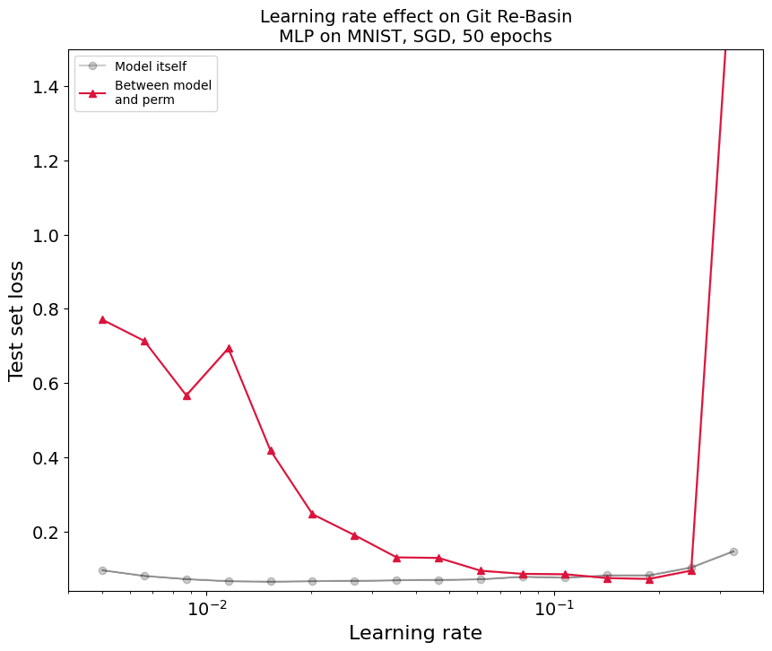
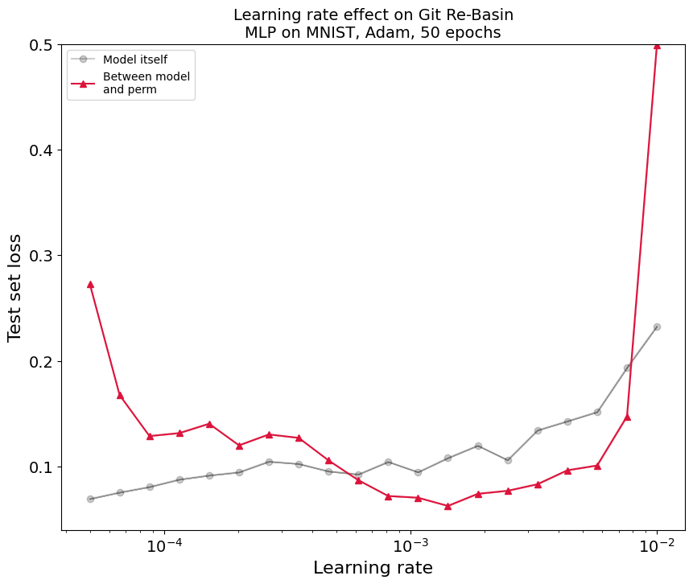
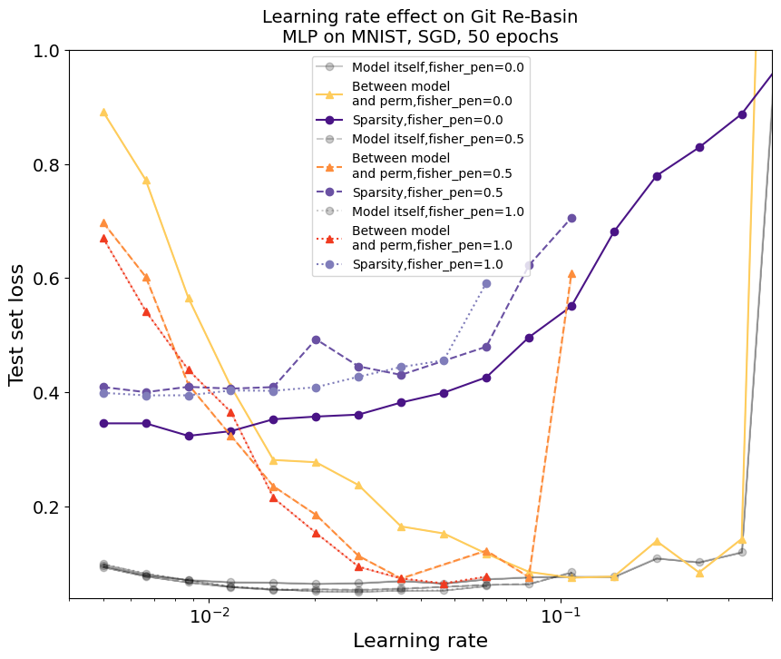
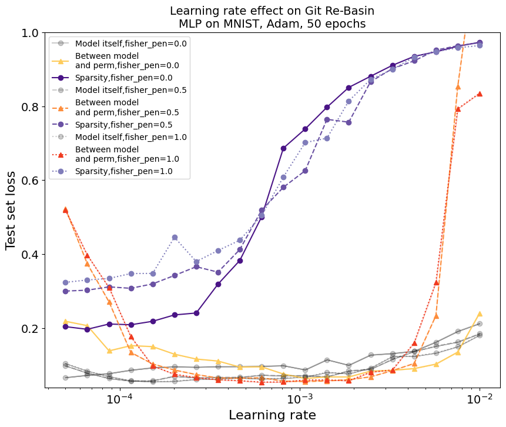

# Flat Minima Interpretability
Figuring out connections between loss landscapes and interpretability.
## Quick Overview

Notebook investigating how to speed up phase changes in grokking [here](https://github.com/AsaCooperStickland/FlatMinimaInterpretability/blob/main/Flat_Minima_%2B_A_Mechanistic_Interpretability_Analysis_of_Grokking.ipynb).

Notebook investigating the Git Re-Basin phenomenon where independently trained models lie in the same loss basin, and how this might be connected to flat minima, [here](https://github.com/AsaCooperStickland/FlatMinimaInterpretability/blob/main/git_rebasin_Asa_MLP_MNIST.ipynb).

## Git Re-Basin

There has been some work (and a lot of discussion on Twitter!) recently about whether the combination of neural nets + sgd produces solutions which lie in the same loss basin. Lying in the same basin means we should be able to find a linear path between two independently trained networks where all points on the path have low loss (if we see a bump, that implies we've arrived in a new basin). Having this linear path of low loss is known as 'linear mode connectivity'.

In particular, the Git Re-Basin [paper](https://arxiv.org/abs/2209.04836) by Samuel Ainsworth et al. showed that under some settings, all we need to get linear mode connectivity is to permute the hidden states of one model so that it matches another. A Twitter [replication](https://twitter.com/stanislavfort/status/1571967289649688576) of this by Stanislav Fort found that this permutation-enabled linear mode connectivity only worked for certain learning rates. In fact he found for plain sgd only with a high learning rate and adam only with a low learning rate. 

I found that's not quite the whole story, and by expanding the range of learning rates tested, I found there is a 'sweet spot' of not too high and not too low learning rates for both optimizers, see plots below. Additionally, it looks like high learning rates caused a sudden explosion in the loss gap between model 1 and model 2, whereas for lower learning rates the increase in gap is slower.

 
 

Fig.1 - Changing learning rate with SGD as the optimizer. The red line represents the maximum gap in loss on the linear path between one model and another that was independently trained and then permuted to match the first model.

 

 

Fig.2 - Changing learning rate with Adam as the optimizer. 

I was interested if flatter minima would change things. Intuitively, the 'simpler' functions that flat minima encourage ([maybe](https://www.alignmentforum.org/posts/EkSvsJkZE8GCeCj7u/basin-broadness-depends-on-the-size-and-number-of-orthogonal-1)) might lead to neural nets where the permutation operations from git re-basin work better. To test this I added a 'Fisher penalty' to the loss, which encourages the trace of the Fisher information matrix to be low - see this [paper](https://arxiv.org/abs/2012.14193) for a discussion of the details. I was also curious how network internals were changing when we see big changes in the linear mode connectivity, so I tracked the percentage of neurons that were firing in each network - in other words the number of activations that were non-zero after applying ReLU, which I refer to in the graphs below as 'sparsity'.

 

 

Fig.2 - Changing learning rate and varying Fisher penalty with SGD as the optimizer. Sparsity refers to the fraction of activations that were non-zero after the ReLU activation function. The models with a Fisher penalty are not plotted above a learning rate of about 0.1 due to training instability.

 

 

Fig.2 - Changing learning rate and varying Fisher penalty with SGD as the optimizer. Sparsity refers to the fraction of activations that were non-zero after the ReLU activation function.

Overall it's difficult to extrapolate from the limited experiments recorded in the graphs above, but we can speculate that Fisher penalties lead to more linear mode connectivity, at least for some learning rate ranges. They also seem to create sparser activations, at least for lower learning rates. Again very speculatively, it's possible that over 50% sparsity is required for Git Re-Basin to work, but that increasing sparsity too much leads to instability. I'm excited to dig in to this idea and get to the bottom of these results!